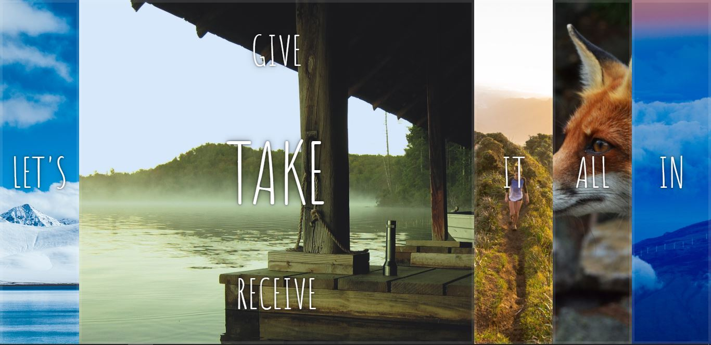

# Flexbox

This is from day 5 of Wes Bos' JavaScript30 course.  In this lesson we made a dynamic website that imports HTML and changes the box size on click. It was made mostly with CSS, but required a little HTML and JavaScript.   If you're interested you can find the course lessons <a href src="https://www.youtube.com/watch?v=9eif30i26jg&list=PLu8EoSxDXHP6CGK4YVJhL_VWetA865GOH&index=5">here.</a>

